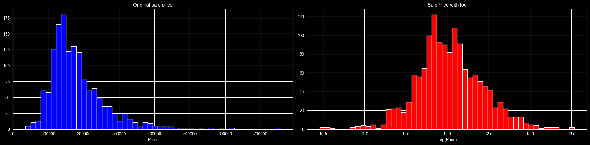
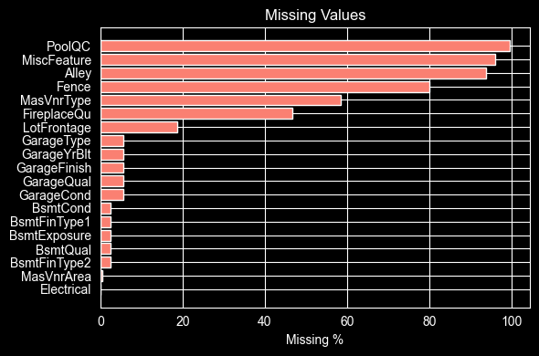
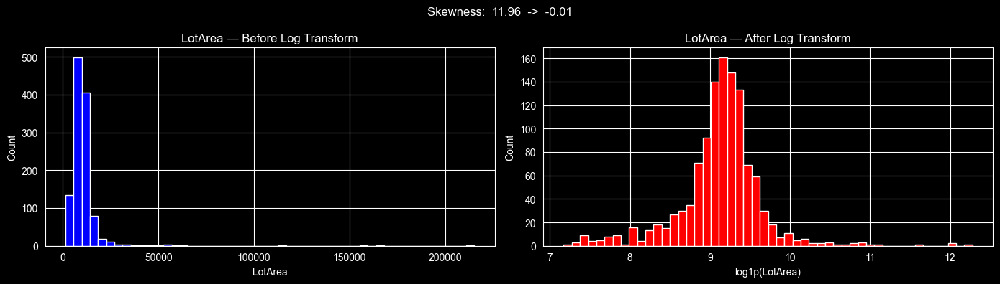
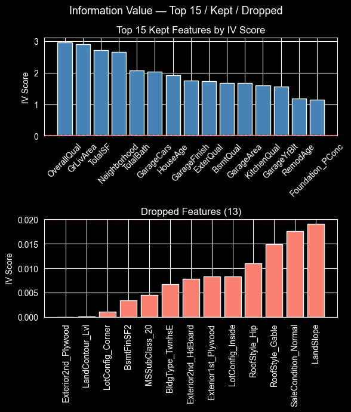
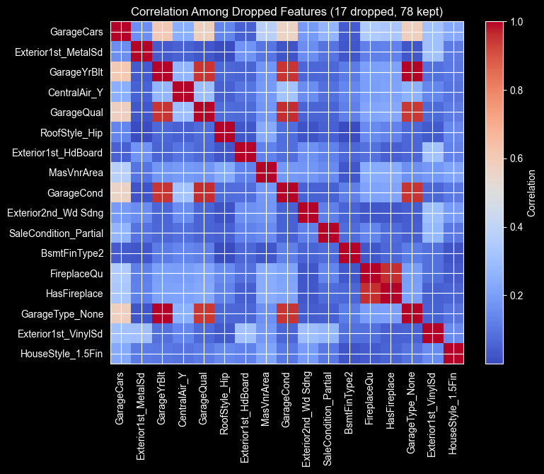

# ML_assn_1: House Prices - Advanced Regression Techniques

## პროექტის მიმოხილვა
ამ დატასეტში გვაქვს 81 სვეტი, რომელშიც ერთ-ერთი არის SalePrice.ჩვენი მიზანია,
დანარჩენი 79(ერთი უბრალოდ Id არის) სვეტის შესაბამისად დამუშავება და ამ დატას მიხედვით მოდელის 
დატრეინება, რომელიც ეცდება გამოიცნოს უნახავი დატისგან შესაბამისი სახლის ფასi.

### მიდგომა
პირველ რიგში, NaN მნიშვნელობების დამუშავება. თავიდანვე ტრეინინგ დათას ვყოფთ
80:20-ზე ტრეინინგ და სატესტო დატად. შემდეგ ისეთ სვეტებს, სადაც შესაბამისი მნიშვნელობები
არ გვაქვს, ვავსებთ ან "None"-ით თუ კატეგორიული ცვლადია რადგანაც არქონა უბრალოდ ნიშნავს
რომ მაგალითად, FireplaceQu-ის შემთხვევაში უბრალოდ არ გვაქვს ბუხარი. რიცვხითი სვეტები კი
უნდა შევავსოთ ან მოდათი ან სხვა შესაფერისი მნიშვნელობებით. ამის შემდეგ, კატეგორიული 
ცვლადები აუცილებლად უნდა გადავიყვანოთ რიცხვითში, რათა ყველა სვეტში რიცხვები გვქონდეს.
ბოლოს ვაკეთებთ სვეტების ქლინინგს სხვადასხვა სტრატეგიებით და ვატრეინებთ მოდელს შესაბამის 
დარჩენილ დატაზე.

პირველ რიგში, ავღნიშნოთ ის, რომ ვიყენებთ ფასების ლოგარითმულ განაწილებას, რადგანაც ისე 
არ არის ნორმალურად განაწილებული და უფრო მარცხნივაა გადახრილი მარჯვნივ დიდი კუდით.
ლოგარითმული განაწილება ბევრად დაეხმარება ჩვენს წრფივ მოდელს.



## ფაილების აღწერა
 
| ფაილი                    | აღწერა                                                                                                                 |
|--------------------------|------------------------------------------------------------------------------------------------------------------------|
| `model_experiment.ipynb` | მთავარი notebook - დათა ქლინინგი, feature engineering, feature selection და მოდელების დატრეინება                       |
| `model_inference.ipynb`  | `MLflow Model Registry-იდან საუკეთესო მოდელის ჩატვირთვა, Kaggle-ის ტესტ სეტზე დაფრედიქთება და submission.csv გენერაცია |
| `README.md`              | პროექტის აღწერა                                                                                                        |

## Data Cleaning
### 1. გამოტოვებული მნიშვნელობების შევსება



დატაში 19 სვეტს ჰქონდა გამოტოვებული მნიშვნელობები.
გამოტოვებული მნიშვნელობები შევავსეთ შემდეგი ლოგიკით:

**"None"-ით შევსება** — სახლს უბრალოდ არ აქვს ეს ფიჩერი:
- PoolQC -> სახლს აუზი არ აქვს
- MiscFeature -> სახლს დამატებითი მახასიათებელი არ აქვს
- Alley -> სახლს შესასვლელი გზა არ აქვს
- Fence -> სახლს ღობე არ აქვს
- FireplaceQu -> სახლს ბუხარი არ აქვს
- GarageType, GarageFinish, GarageQual, GarageCond -> გარაჟი არ აქვს
- BsmtQual, BsmtCond, BsmtExposure, BsmtFinType1, BsmtFinType2 -> სარდაფი არ აქვს

**0-ით შევსება** — რიცხვითი სვეტები, სახლს არ აქვს:
- GarageYrBlt, MasVnrArea -> 0

**სამეზობლოს მედიანით შევსება:**
- LotFrontage -> იგივე სამეზობლოს სახლებს დაახლოებით მსგავსი
  ეზოს ზომა აქვთ, ამიტომ ვიყენებთ შესაბამისი სახლის მედიანას

**მოდიით შევსება** — მონაცემი არ იყო ასახული:
- Electrical(1 აკლდა) -> ყველაზე გავრცელებული მნიშვნელობა


## Feature Engineering
### კატეგორიული ცვლადების რიცხვითში გადაყვანა

ზოგ სვეტს აქვს ერთი და იმავე მიმდევრობა, რომელსაც განვსაზღვრავთ შემდეგი მეპით:
```
quality_map = {None: 0, Po: 1, Fa: 2, TA: 3, Gd: 4, Ex: 5}
```
შესაბამისი სვეტები: 'GarageQual', 'GarageCond', 'PoolQC', 'ExterQual',
'ExterCond', 'BsmtCond', 'HeatingQC', 'KitchenQual','BsmtQual', 
'FireplaceQu'

სხვა სვეტები საკუთარი მაპით:
- BsmtExposure: None=0, No=1, Mn=2, Av=3, Gd=4
- BsmtFinType1/2: None=0, Unf=1, LwQ=2, Rec=3, BLQ=4, ALQ=5, GLQ=6
- GarageFinish: None=0, Unf=1, RFn=2, Fin=3
- Fence: None=0, MnWw=1, GdWo=2, MnPrv=3, GdPrv=4
- Functional: Sal=1 ... Typ=8
- PavedDrive: N=0, P=1, Y=2
- LandSlope: Sev=1, Mod=2, Gtl=3
- LotShape: IR3=1, IR2=2, IR1=3, Reg=4

Neighborhood სვეტს 25 უნიკალური მნიშვნელობა
აქვს. მისი One-hot encoding შექმნიდა 25 ახალ სვეტს. ამის მაგივრად
თითოეული სამეზობლო შევცვალეთ იმავე სამეზობლოს საშუალო ფასით, რომელიც
გამოვთვალეთ სატრენინგო მონაცემებიდან.

**One-Hot Encoding** — დარჩენილი კატეგორიული სვეტები:
MSSubClass, MSZoning, Street, Alley, LandContour, LotConfig,
Condition1, Condition2, BldgType, HouseStyle, RoofStyle, RoofMatl,
Exterior1st, Exterior2nd, MasVnrType, Foundation, Heating,
CentralAir, Electrical, GarageType, MiscFeature, SaleType,
SaleCondition 

**Fixing Column Distributions** - ზოგ სვეტში მონაცემთა განაწილება, როგორც sale price, არ იყო 
ნორმალურთან ახლოსაც კი, ამიტომ ლოგარითმი მოვდეთ რათა დაგვემსგავსებინა ნორმალურ განაწილებასთან.
ეს ეხმარება წრფივ მოდელებს, მაგრამ ხეებში მნიშვნელობა არ აქვს. მაგალითად, LotArea: 



## Feature Selection

### 1. თითქმის ერთი და იმავე მნიშვნელობის მქონე სვეტების წაშლა
თუ სვეტში ერთი მნიშვნელობა გვხვდებოდა 95%-ზე მეტჯერ, წავშალეთ ეგ სვეტი, რადგანაც დიდად არ გვეხმარება არაფერში.

### 2. ახალი სვეტები

- **TotalSF** = TotalBsmtSF + 1stFlrSF + 2ndFlrSF
- **TotalBath** = FullBath + BsmtFullBath + 0.5 * HalfBath + 0.5 * BsmtHalfBath
- **TotalPorch** = OpenPorchSF + EnclosedPorch + ScreenPorch
- **HouseAge** = YrSold − YearBuilt
- **RemodAge** = YrSold − YearRemodAdd
- **IsRemodeled** = რემონტი ჩაუტარდა თუ არა
- **HasGarage**, **HasFireplace**, **HasPorch**, **HasBsmt** — 0/1 სვეტები, აქ თუ არა სახლს

### 3. სხვადასხვა ფილტრი
მაქვს სამი სხვადასხვა კლასი, რომელსაც გამოვიყენებ მონაცემების გასაფილტრად და სვეტების რაოდენობის შესამცირებლად.

#### IVSelector (Information Value)
Information Value ზომავს ცვლადის "პროგნოზულ ძალას". Threshold-ად ავიყე 0.02.
სტანდარტულად, თუ $IV < 0.02$, ცვლადი ითვლება "არაპროგნოზულად".



#### CorrelationFilter კორელაციის ფილტრი (Threshold = 0.85)
იღებს იმ ცვლადებს, რომელთა შორის კორელაცია 0.85-ზე მეტი არის. 
თუ ორი ცვლადი ერთმანეთთან ძალიან ძლიერადაა დაკავშირებული,
ისინი მოდელისთვის ერთსა და იმავე ინფორმაციას ატარებენ (redundancy). ეს კი აფუჭებს მოდელის ინტერპრეტაციას. 



#### RFE (Recursive Feature Elimination)
მითითებული ალგორითმის გამოყენებით(დიფოლტად Ridge(alpha=1.0) გვაქ) გამოყენებით არჩევს n_features_to_select(დიფოლტად 40)
სვეტს. RFE თანდათან აკლებს ყველაზე სუსტ ცვლადებს, სანამ სასურველ რაოდენობას არ მიაღწევს.

---

## ტრენინგი და ექსპერიმენტები

ყველა ექსპერიმენტი დავლოგე MLflow-ში DagsHub-ზე. თითოეული მოდელისთვის დავლოგე:

- `cv_rmse`, `test_rmse`, `gap`, `cv_rmse_log`, `test_rmse_log`, `cv_mae`, `test_mae`
- `cv_r2`, `test_r2`
- ყველა ჰიპერპარამეტრი
- დატრენინგებული მოდელი

---

### Linear Models 
წრიფი მოდელებისათვის გავუშვი 39 ვარიანტი cross validation-ით, (correlation filter, IV filter, RFE) x 
13 სხვადასხვა ჰიპერმეტრიანი მოდელი. მივიღე ესეთი ტოპ 12 შედეგი: 

| Rank | Model | Selection Strategy | Features | Test RMSE |
|---|---|---|---|---|
| 1 | Ridge (α=10) | IV Filter | 82 | $27,623 |
| 2 | Lasso (α=0.001) | Corr Filter | 78 | $27,656 |
| 3 | LinearRegression | Corr Filter | 78 | $27,684 |
| 4 | Ridge (α=0.1) | Corr Filter | 78 | $27,684 |
| 5 | Ridge (α=1) | Corr Filter | 78 | $27,686 |
| 6 | Lasso (α=0.001) | IV Filter | 82 | $27,691 |
| 7 | Ridge (α=1) | IV Filter | 82 | $27,698 |
| 8 | LinearRegression | IV Filter | 82 | $27,710 |
| 9 | Ridge (α=0.1) | IV Filter | 82 | $27,712 |
| 10 | Ridge (α=10) | Corr Filter | 78 | $27,718 |
| 11 | ElasticNet (α=0.01, l1=0.2) | IV Filter | 82 | $27,900 |
| 12 | ElasticNet (α=0.01, l1=0.2) | Corr Filter | 78 | $27,923 |

ტოპ 12 მოდელს შორის 300 დოლარიანი შუალედია მარტო, რაც გვეუბნება რომ წრფივი მოდელები
ძირითადად იგივე პერფომანსს დებენ ჩვენს დატასეტზე. RFE საერთოდ არ გვხვდება ტოპში, იმიტომ რომ
სვეტების რაოდენობა 40-მდე შეამცირე მაგან და დაკარგა მნიშვნელოვანი ინფო როგორც ჩანს. რეგულარიზაციამაც
არ გვიშველა ძალიან, რაც იმაზე მიუთითებს რომ არ გვქონდა მაღალი კორელაცია სვეტებს შორის, იმიტო რო
Corr Filter-მა გააქრო მაგენი ძირითადად. 

### Decision Tree Models
გავუშვი 30 ვარიანტი cross validation-ით, (no_selection, corr_filter, iv_filter) x 10 სხვადასხვა
ჰიპერპარამეტრიანი მოდელი. მივიღე ესეთი ტოპ 12 შედეგი:

| Rank | Model | Selection Strategy | Features | Test RMSE |
|---|---|---|---|---|
| 1 | DT (depth=10) | No Selection | 95 | $34,680 |
| 2 | DT (depth=10) | IV Filter | 82 | $35,481 |
| 3 | DT (depth=10, leaf=10) | Corr Filter | 78 | $35,620 |
| 4 | DT (depth=10, leaf=5) | Corr Filter | 78 | $35,794 |
| 5 | DT (depth=None) | No Selection | 95 | $36,484 |
| 6 | DT (depth=10, leaf=5) | IV Filter | 82 | $36,620 |
| 7 | DT (depth=10, leaf=5) | No Selection | 95 | $36,622 |
| 8 | DT (depth=5, leaf=5) | Corr Filter | 78 | $36,728 |
| 9 | DT (depth=None) | IV Filter | 82 | $36,916 |
| 10 | DT (depth=15) | No Selection | 95 | $36,983 |
| 11 | DT (depth=10, leaf=10) | Corr Filter | 78 | $37,048 |
| 12 | DT (depth=15) | IV Filter | 82 | $37,104 |

საუკეთესო შედეგი მიიღო depth=10-მა no_selection სტრატეგიით — $34,680 test RMSE-ით. წრფივი
მოდელებისაგან განსხვავებით, აქ no_selection ჯობია feature selection სტრატეგიებს, რაც იმაზე
მიუთითებს რომ კორელირებული სვეტები ხეს არ უშლის ხელს — პირიქით, redundant
feature-ები სარეზერვოდ გამოადგება split-ების დროს.

depth=None depth=10-ზე უარესია ($36,484 vs $34,680), რაც კლასიკური
overfitting-ია — ძალიან ღრმა ხე train set-ს ზეპირად ისწავლის და ტესტზე ვეღარ განზოგადებს.
depth=15-იც depth=10-ზე უარესი აღმოჩნდა, ანუ ოპტიმალური სიღრმე ამ დატასეტისთვის დაახლოებით
8-12-ს შორისაა.

min_samples_leaf-ის დამატება (leaf=5, leaf=10) არარეგულარულ გაუმჯობესებას იძლევა — ზოგან
ეხმარება, ზოგან არა, depth-ის მიხედვით. ეს გვეუბნება რომ depth უფრო მნიშვნელოვანია აქ.

ზოგადად, decision tree-ები წრფივ მოდელებს ჩამორჩებიან ($34,680 vs $27,623) — დაახლოებით
$7,000-იანი შუალედით. ეს მოსალოდნელი იყო: ლოგარითმმოდებული sale price პრაქტიკულად
წრფივია, და ხეები ამ წრფივი ურთიერთობების დაჭერას ნაკლებ ეფექტურად ახერხებენ ვიდრე Ridge/Lasso.

